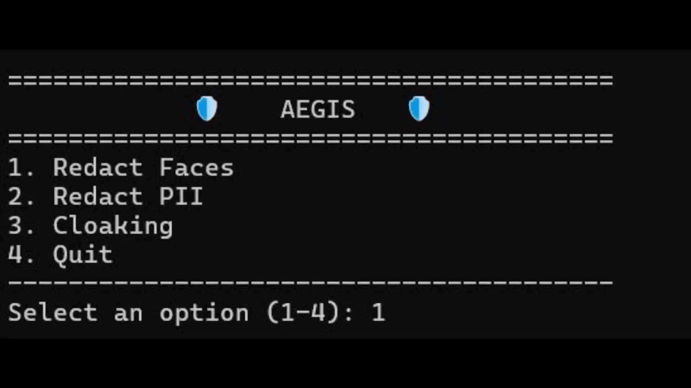

# Aegis


**Aegis** is a privacy-focused image processing tool designed to protect user identity in photos. It seamlessly combines traditional redaction techniques—such as blurring faces and Personally Identifiable Information (PII)—with advanced adversarial cloaking to inoculate user photos against unauthorized facial recognition models.



## Key Features

* **Face Redaction:** Automatically detects faces and allows users to selectively blur them to prevent visual identification.
* **PII Redaction:** Scans images for text (Personal Identifiable Information) and automatically blurs detected regions to prevent data leakage.
* **Adversarial Cloaking:** Implements <a href="https://people.cs.uchicago.edu/%7Eravenben/publications/pdf/fawkes-usenix20.pdf">the Fawkes algorithm</a> to add imperceptible pixel-level perturbations. These "cloaks" poison the training data of unauthorized models. This ensures that any new facial recognition systems built using your scraped photos will fail to recognize your real face in the future.

## Tech Stack

**Language:** Python 3.10+

**Core Libraries & Models:**
* **Deep Learning Framework:** PyTorch (`torch`, `torch.nn`, `torch.optim`) & Torchvision.
* **Cloaking Engine:** **ResNet50** (Pre-trained on ImageNet) used for feature extraction.
* **Face Detection:** **MTCNN** (Multi-task Cascaded Convolutional Networks).
* **OCR Engine:** **EasyOCR** for text detection.
* **Image Processing:** OpenCV (`cv2`) for Gaussian blurring and I/O; PIL (`Image`) and NumPy for matrix manipulations.


## Installation & Setup

Follow these steps to run the project locally on your machine.

### Prerequisites

* Python 3.10 or above
* **Hardware (Optional):** A machine with a GPU (CUDA) is highly recommended for the Cloaking phase.

### Installation

1.  **Clone the repository**
  

2.  **Create a Virtual Environment**
    ```bash
    python -m venv venv
    # Windows
    venv\Scripts\activate
    # macOS/Linux
    source venv/bin/activate
    ```

3.  **Install dependencies**
    ```bash
    pip install -r requirements.txt
    ```

4.  **Run the application**
    <p>Run the interactive CLI application:<p>

    ```bash
    python app.py
    ```


